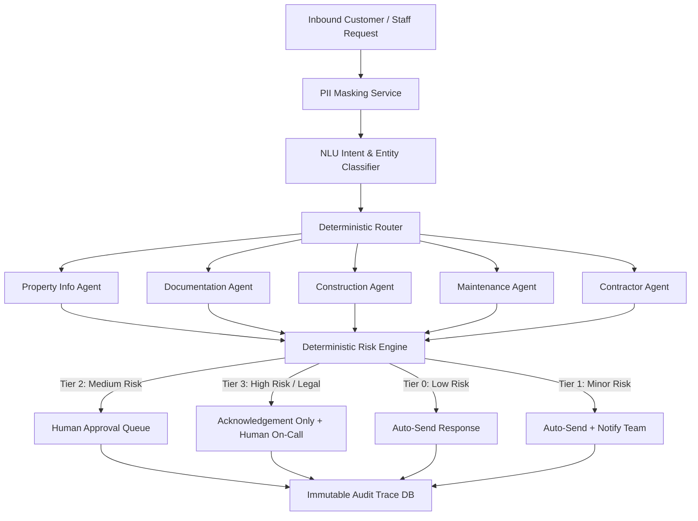
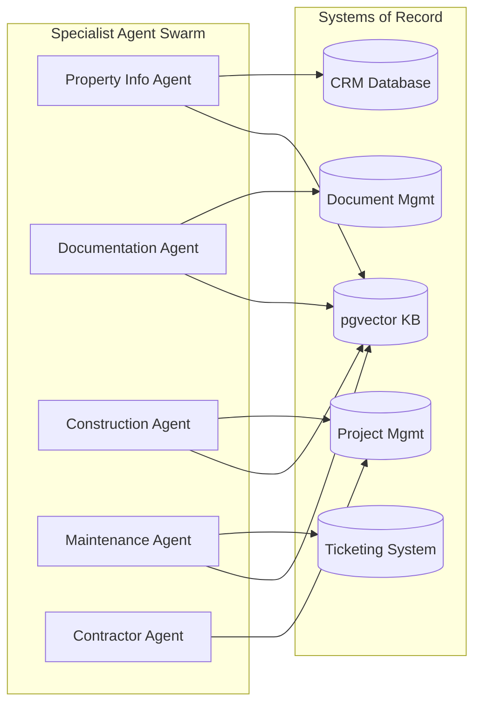
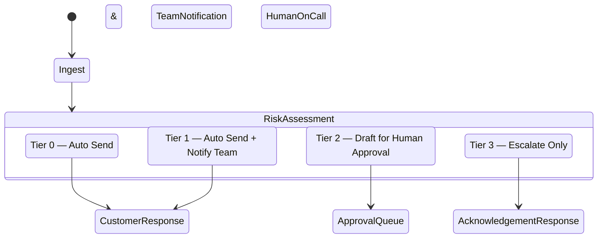

# BuildWise Platform — Complete End-to-End Walkthrough
> **Target Audience**: Business Executives, Product Managers, Customer Operations, AI Engineers, and DevOps teams.  
> **Purpose**: A comprehensive guide explaining the BuildWise Agentic AI Support Platform from scratch to full deployment.

---

## 1. What is BuildWise?

**BuildWise** is an enterprise-grade, **Agentic AI Support & Operations OS** built specifically for real estate developers, construction managers, and property management firms. 

In real estate and construction, customer support and site operations deal with high-risk, high-value inquiries:
- **Customers & Buyers** asking for construction progress, milestone dates, payment breakdowns, or legal document checklists.
- **Residents** reporting safety-critical issues like gas leaks, elevator entrapment, or structural cracks.
- **Contractors & Site Engineers** submitting raw daily site logs, material shortage alerts, or milestone delays.

Traditional AI chatbots often fail in these environments because they **hallucinate prices**, **leak confidential delay dates**, or **wrongly promise discounts and refunds**.

BuildWise solves this by combining **specialized AI agents** with **strict deterministic Python guardrails** and a **human-in-the-loop governance queue**.



---

## 2. The 5 Golden Non-Negotiable Safety Rules

The architecture follows five strict rules enforced at the code level:

| Rule | Principle | How It Works |
|---|---|---|
| **1. Numbers from Connectors, Prose from KB** | Never ask AI to guess numbers. | Prices, dates, ticket IDs, and unit availabilities are fetched as typed fields directly from databases (CRM, ERP, Project Mgmt). The AI model only formats readable text around them. |
| **2. Authorization Below the AI Model** | Access control is enforced in SQL, not prompts. | Database queries pre-filter data using an `AccessScope` (User Role, Unit IDs, Project IDs) *before* it reaches any AI prompt. A prompt injection attack cannot read data the user lacks permission to view. |
| **3. Deterministic Policy in Code** | Risk assessment is pure Python code. | Routing, risk tiering, SLA clocks, and priority matrices are written in standard Python with 100% unit test coverage—never delegated to probabilistic prompt instructions. |
| **4. Uncertainty is an Output** | Low confidence routes to a human. | Every agent outputs a confidence score (0.0 to 1.0). If confidence falls below threshold (e.g., 0.70) or sources conflict, the case is automatically escalated to a human. |
| **5. Financial Read-Only Safeguard** | Read-only payment connectors. | No AI code path can issue a refund, discount, waiver, or payment transaction. |

---

## 3. How a Request Flows (Step-by-Step)

### Step 1: PII Masking & Privacy (`core/masking.py`)
Before any message is logged or passed to an AI model, sensitive Indian PII patterns are masked in memory:
- **PAN Cards**: `ABCDE1234F` → `[PAN_1]`
- **Aadhaar Numbers**: `1234 5678 9012` → `[AADHAAR_1]`
- **Bank Accounts & Phones**: Masked dynamically.
- *Reversible tokens are maintained in memory only for the duration of the request.*

---

### Step 2: Intent Classification & Entity Extraction (`agents/classification.py`)
The system classifies incoming messages into **9 Canonical Intents** and extracts structured entities:

1. **`SALES_INQUIRY`**: Pricing, floor plans, brochure requests.
2. **`BOOKING`**: Booking status, unit allotment, token payments.
3. **`DOCUMENTATION`**: Sale agreement, KYC, loan NOC checklists.
4. **`PAYMENT`**: Demand notes, payment milestones, receipts.
5. **`CONSTRUCTION_STATUS`**: Tower progress, slab dates, possession updates.
6. **`MAINTENANCE`**: Plumber, electrical, structural, gas leak complaints.
7. **`CONTRACTOR_UPDATE`**: Daily site notes, material delay alerts.
8. **`COMPLAINT_ESCALATION`**: Legal notice threats, refund demands, RERA complaints.
9. **`OTHER`**: General inquiries.

---

### Step 3: Multi-Agent Swarm Processing (`agents/`)



- **Construction Agent Dual-Output**: Generates two distinct summaries:
  - **Internal Technical Summary**: Includes contractor disputes, raw site logs, unapproved target dates, and safety flags for site engineers and managers.
  - **Customer-Safe Summary**: Omits unapproved dates and internal vendor friction, presenting only officially approved milestones.
- **Maintenance Agent**: Automatically detects safety-critical emergencies (gas leaks, elevator entrapments, structural beam cracks) and immediately alerts on-call emergency staff within a 2-hour SLA window.

---

### Step 4: Deterministic Risk Tiering (`orchestration/risk_engine.py`)

The Risk Engine evaluates every case against a 4-tier risk matrix:



- **Tier 0 (`AUTO`)**: Standard informational requests with high confidence (e.g., brochure requests, published amenities).
- **Tier 1 (`AUTO_NOTIFY`)**: Automatically answered, but notifies the internal team (e.g., payment milestone clarification).
- **Tier 2 (`DRAFT_APPROVAL`)**: The AI drafts a response, but a **human staff member must review, edit, or approve** before it is sent to the customer (e.g., possession date delay explanations).
- **Tier 3 (`ESCALATE_ONLY`)**: The AI sends an immediate formal acknowledgement with an SLA clock commitment, and **hands total ownership over to the legal/management team** (e.g., legal notice threats, RERA complaints, refund demands, safety emergencies).

---

### Step 5: Immutable Audit & Trace Replay (`governance/audit.py`)
Every decision, prompt version, retrieved document chunk, confidence score, and latency figure is recorded in an **append-only PostgreSQL audit table (`agent_trace`)**. 
- Database triggers reject `UPDATE` or `DELETE` commands on audit logs.
- The **Audit Viewer UI** allows staff and compliance officers to replay any past Case ID step-by-step.

---

## 4. Visual Interface Tour (Glassmorphic AI OS Console)

The BuildWise web console (`http://localhost:3000/`) is designed as a **Glassmorphic AI Operating System**:

### 1. Header & Access Scope Switcher
- **Sticky Glass Header**: Real-time indicator showing active model backend (`LLM: OPENAI`).
- **Role Switcher**: Switch identity on the fly to test RBAC authorization (e.g., *Deepak Verma (Sales Executive)*, *Priya Sharma (Customer)*, *Vikram Singh (Site Engineer)*).
- **Dynamic Navigation**: External roles only see the **Conversation** console. Internal roles gain access to **Approvals**, **Operations**, and **Audit**.

### 2. Conversation View (`web/src/pages/Chat.tsx`)
- **Message Bubbles**: Color-coded by identity (Customer vs. AI Support vs. Site Engineer).
- **Response Metadata**: Shows latency (ms), token consumption, estimated cost ($), and confidence score badges.
- **Citation Chips**: Inspect exact source documents, policy sections, and staleness warnings.
- **Role Scenarios**: Quick-start buttons to test real-world scenarios (e.g., *Slab progress query*, *Missing document check*, *Gas leak emergency*).

### 3. Human Approvals Queue (`web/src/pages/Approvals.tsx`)
- **SLA Breach Clocks**: Visual countdown timers highlighting urgent tickets.
- **Reasoning Sidebar**: Displays why the case was flagged (Risk Tier rationale, citations, confidence score).
- **One-Click Actions**: `Approve & Send`, `Edit Draft`, or `Reject & Reassign`.

### 4. Operations Dashboard (`web/src/pages/Dashboard.tsx`)
- **Executive KPI Cards**: Total volume, median response latency, active escalations, human override rates.
- **Risk Tier Distribution**: Visual breakdown of Tier 0 through Tier 3 traffic.
- **NLU Intent Distribution & SLA Compliance**: Real-time charts tracking service delivery.

### 5. Audit Trace Viewer (`web/src/pages/Audit.tsx`)
- **Search Spine**: Search by Case ID or query text.
- **Deterministic Step Tree**: View exact prompt versions, retrieved vector chunks, and raw vs. masked inputs.

---

## 5. Technical Stack & Repository Structure

### Core Technologies
- **Backend API**: Python 3.11, FastAPI (Async endpoints), Pydantic v2.
- **Database & Vectors**: PostgreSQL 16 + `pgvector` extension for hybrid search.
- **Caching & State**: Redis 7.
- **Frontend**: React 18, TypeScript 5, Vite, Vanilla CSS + Tailwind CSS (Glassmorphic design system).
- **Containerization**: Podman / Docker Compose.

### Directory Structure
```
buildwise-agentic/
├── AGENTS.md                  # Canonical types and golden safety rules
├── docker-compose.yml         # 5-container service orchestration
├── pyproject.toml             # Python dependencies and build config
├── api/                       # FastAPI application & route controllers
├── core/                      # Canonical Pydantic models, enums, PII masking
├── agents/                    # Specialist agents (BaseAgent subclassed)
├── orchestration/             # State graph, deterministic router & risk engine
├── retrieval/                 # Chunker, pgvector store, hybrid BM25 search
├── connectors/                # CRM, Project Mgmt, Payments, DMS, Ticketing
├── governance/                # Audit writer, RBAC scope enforcement, SLA clocks
├── llm/                       # Provider-agnostic LLM client & versioned prompts
├── db/                        # PostgreSQL schema & deterministic seed scripts
├── web/                       # React + TypeScript + Glassmorphic UI
└── tests/                     # Unit, Integration, and Security test suites
```

---

## 6. How to Run the Platform Locally

### Prerequisites
- `podman` or `docker` with `docker-compose`.
- An OpenAI API Key (configured in `.env`).

### Quick Start Commands

1. **Clone & Setup Environment**:
   ```bash
   git clone https://github.com/YESVIN2807/buildwise-agentic.git
   cd buildwise-agentic
   cp .env.example .env
   # Edit .env and paste your OPENAI_API_KEY
   ```

2. **Start All Containers**:
   ```bash
   podman compose up -d
   # OR: docker compose up -d
   ```
   *This starts the API (8000), Postgres+pgvector (5432), Redis (6379), Mock Connectors (8100), and Frontend (3000).*

3. **Verify Deployment**:
   - **Web Console**: Open `http://localhost:3000/` in your browser.
   - **API Docs**: Open `http://localhost:8000/docs`.
   - **Mock Services**: Open `http://localhost:8100/docs`.

4. **Pull Request Reference**:
   - GitHub Pull Request: [#1 Modernize frontend with Glassmorphic AI OS design system](https://github.com/YESVIN2807/buildwise-agentic/pull/1)

---

## 7. Summary

BuildWise demonstrates how **Agentic AI** can be safely deployed in enterprise environments. By decoupling prose generation from factual data retrieval and placing deterministic Python safety guardrails around the AI models, BuildWise delivers **fast, accurate, grounded, and fully auditable operations** for real estate and construction management.
